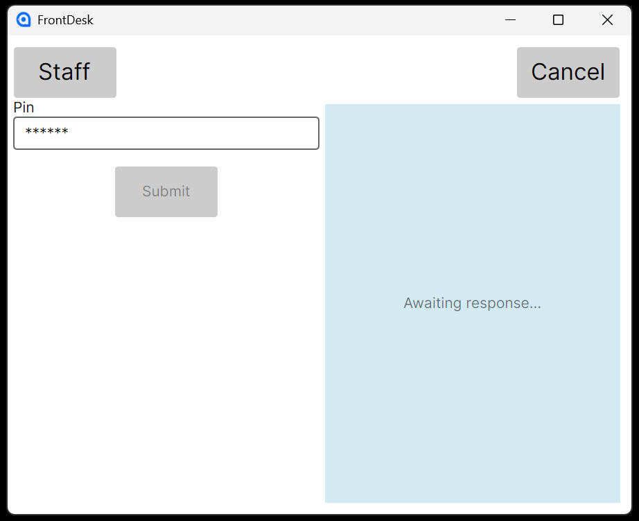
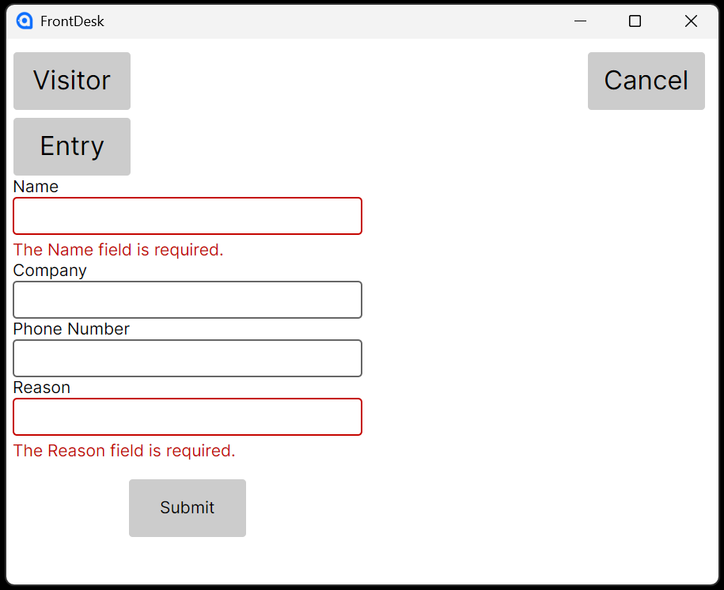

# Front Desk

A personnel logbook system demonstrating:
- ASP.NET Core, Middleware, Rate-limiting
- PostgreSQL
- Entity Framework Core, Migrations
- Avalonia desktop UI
- Continuous Integration (CI)
- Unit tests, Integration tests, UI tests

<p align="center">
  
</p>

<p align="center">
  
</p>

## Tech Stack
- ASP.NET Core
- Entity Framework Core
- PostgreSQL
- Avalonia UI (Desktop)
- XUnit, Testcontainers (on Docker Desktop)

## Overview
- PostgreSQL is used to persist application data
- Staff entry/exit with a 6-digit pin (must be active)
- Visitors require details on entry, and exit with a temporary one-off pin

## Auth
- Simplified for demo purposes (staff users are seeded)
- The client sends an api key in an HTTP header, that is validated by Api middleware

## Local Development
### Requirements
- .NET 9.0 SDK
- PostgreSQL instance
- Docker Desktop (required for integration tests only)

### Database Configuration
Set the PostgreSQL connection string using either:
- `appsettings.Development.json`
- User Secrets
```json
{
  "ConnectionStrings": {
    "Default": "host=host;port=5432;database=frontdesk;username=username;password=password;"
  }
}
```
- The database schema is applied automatically on startup using EF Core migrations.

### Api key
Set a system environment variable:
- Key: "LPK_DEMO_API_KEY"
- Value: any non-empty value

### Running the App
Set the following as startup projects:
- `FrontDesk.Api`
- `FrontDesk.Ui`

Demo staff pins (automatically seeded in `FrontDesk.Db.Data.SeedData`):
- Office Worker, Pin = "111111"
- Warehouse Worker, Pin = "222222",
- Casual Worker, Pin = "333333" (Inactive)

## Tests
- `FrontDesk.UnitTests` and `FrontDesk.UiTests` run without external dependencies.
- `FrontDesk.IntegrationTests` requires Docker Desktop to be running for Testcontainers to run on a real PostgreSQL instance.

## CI
- CI runs Unit and Ui tests only

## License
- All Rights Reserved © 2025 lpkpub
- This repository is provided for viewing and evaluation purposes only as part of a personal portfolio.
- You may not use, copy, modify, or distribute this code for commercial or non-commercial purposes without explicit permission from the author.